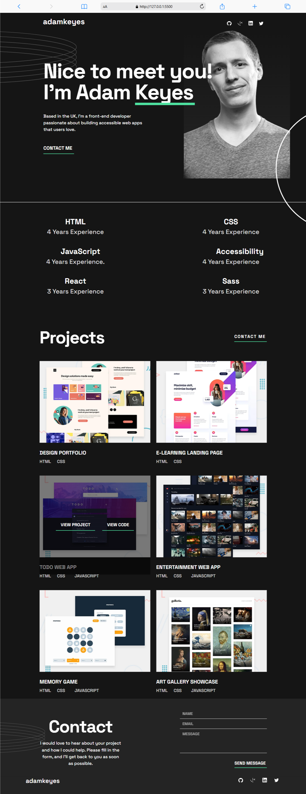
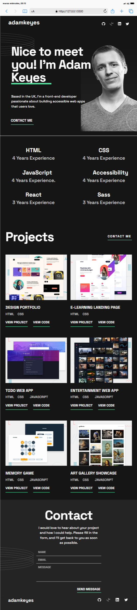
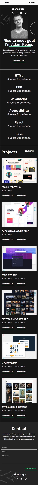

# Portfolio 🌐

Este proyecto presenta un portfolio a modo responsive.

---

  

  

  

---

## Tecnologías Utilizadas ⚙️

- 
- 
- 

## 📱 Responsive Design

El proyecto está diseñado para ser 100% responsive, adaptándose correctamente a los siguientes dispositivos:

- 📱 Móviles (320px - 480px)
- 📱 Tablets (768px)
- 📱 Tablets Horizontales
- 💻 Escritorios (1024px en adelante)

## Contribuciones 🤝

Las contribuciones son bienvenidas. Para problemas, ideas o nuevas características, por favor abre un issue o un pull request.

## Contacto 📫

¿Necesitas un diseño web personalizado? Contáctame:

## Licencia 📜

Este proyecto está bajo la licencia [MIT](LICENSE).
